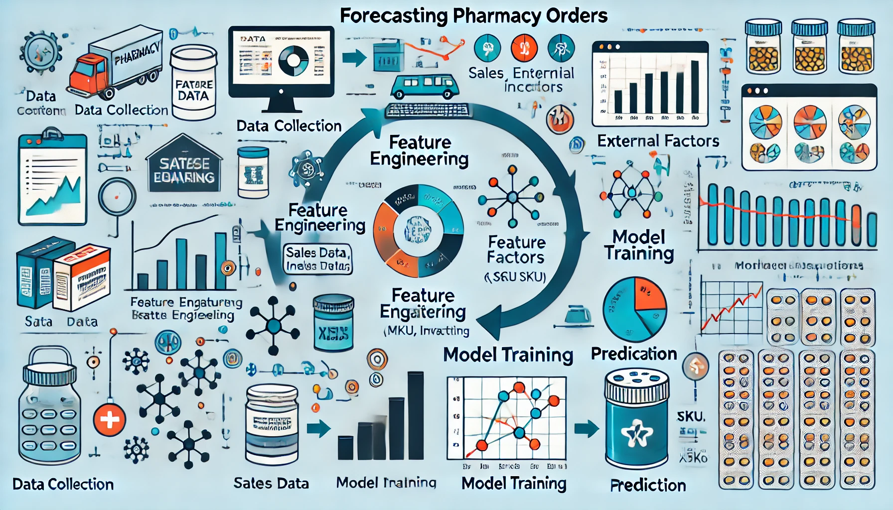
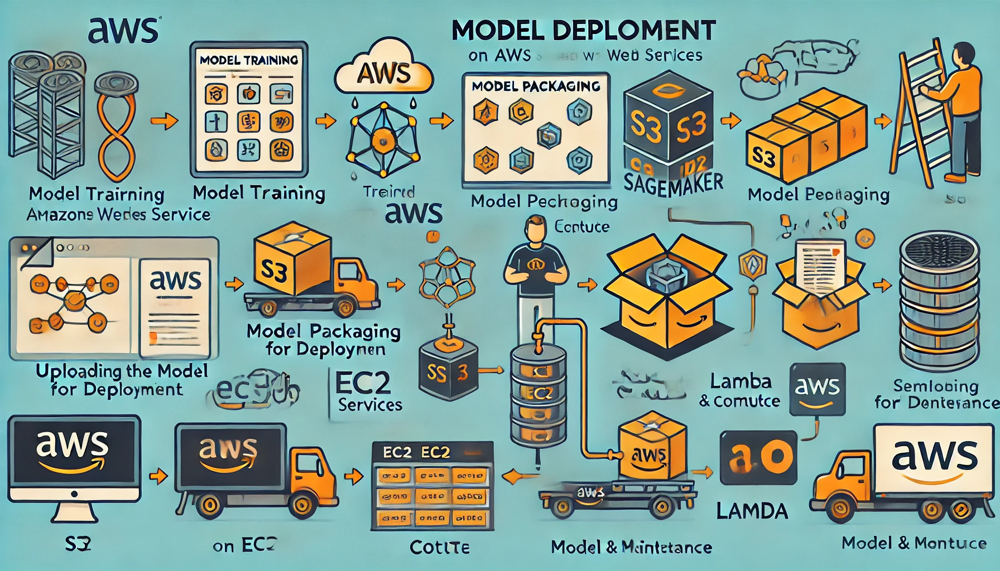

# Data Science Associate Consultant
Bengaluru, India

---

## Education

**MTech in Communication and Networks** from Indian Institute of Science, Bengaluru 

**BTech in Electronics and Telecommunication Engineering** from Vishwakarma Institute of Technology, Pune 

---
## Work Experience

### Data Science Associate Consultant @ ZS Associates, Bangalore (_July 2022 - Present_)

**Drug Storage Prediction**
  - Designed and implemented a predictive model using the transformer to forecast drug shortages.
  - Aggregated internal and external data, with LLMs extracting critical features from news sources.
  - Resulted in early detection of national drug shortages with a lead time of 1-2 months.

 

  
  

**Pharmacy Orders Forecasting**
  - Constructed a predictive model using XGBoost and ALS to forecast pharmacy orders for retention and cross-selling.
  - Deployed the model end-to-end on AWS infrastructure and utilized OpenAI for model output explainability.
  - Achieved improved sales efficiency and enhanced customer experience.
    

  
  

**Bayesian Market Mix Model and Budget Optimizer**
  - Developed a Bayesian Market Mix Model and budget optimizer for a retail chain.
  - Evaluated marketing impact and optimized channel spend.
  - Utilized GPT-3.5 to summarize recommendations and compare scenarios.
  - Estimated 20-25% revenue uptake through our recommendations.

### Data Science Associate @ ZS Associates, Bangalore (_August 2020 – June 2022_)

**Predictive Lead Scoring Model**
  - Developed and deployed a predictive lead scoring model for a med-tech device manufacturer using AWS SageMaker.
  - Implemented feature engineering and selection processes.
  - Resulted in enhanced lead targeting and optimized resource use, increasing conversion rates.

**Gate-Checked Bags Forecasting**
  - Formulated an ML model using CatBoost and ANN to forecast gate-checked bags for an airline.
  - Leveraged flight and passenger data with feature engineering and model optimization to improve prediction accuracy.
  - Achieved a 10-15% reduction in under-prediction of gate-checked bags.

**Insights Extraction Pipeline**
  - Orchestrated an end-to-end pipeline to extract insights from various data sources using NLI models like PubMedBERT on Azure Databricks.
  - Enhanced decision-making and identified critical insights for strategic product narratives (SPN).

### Machine Learning Intern @ Apra Labs, Bangalore (_May 2019 - July 2019_)

**Gaze Capture iOS App**
  - Created a gaze capture iOS app to collect gaze data and trained a model to estimate gaze location.
  - Utilized the model to develop an iOS game and a driver safety application.

### Engineer in Automobile Business Unit @ Tata Elxsi, Bangalore (_August 2016 - May 2017_)

**RTOS Operations**
  - Handled RTOS operations and coordinated different system services and OS calls (IPC) for Audio Amplifiers.
    
---
## Technical Skills

**Fields of Interest:**  
Machine Learning, Deep Learning, MLOps, NLP, BERT, Transformer, GPT, LLMs, LangChain, RAG, Agents, Computer Vision, Image Processing, Diffusion, Linear/Non-Linear Optimization, Bayesian Statistics

**Developer Tools:**  
Git, Google Cloud Platform, Databricks, AWS, PySpark, PyTorch, Keras, JAX

**Programming Languages:**  
Python, SQL

**Libraries and Frameworks:**  
Scikit-learn, Pandas, Tensorflow, Keras, Matplotlib, Seaborn, Plotly

---
## Awards

**Fostering ZS Culture (Mar 2024):** For fostering ZS culture during the Next Best Order project.

**BHC Project Award (Nov 2023):** For developing an MMM and budget optimization for a retail chain.

**Ingenious Award (Aug 2023):** For leadership in fostering growth in the Beyond Healthcare domain.

**Going Above and Beyond:** For exceptional dedication and performance, awarded during AI Summit 2022.

**Project Champion Award (Aug 2022):** For contributions to the "UA - Airport Predictive Operations" project.

**Impact Award (Oct 2021):** For performance in the "Amgen Medical SPN Analytics - POC" project.

---

## Know Me Beyond Work

Outside of my professional life, I am passionate about exploring new technologies, travelling, and engaging in community service. I enjoy reading about advancements in AI and ML, participating in hackathons, and contributing to open-source projects.
