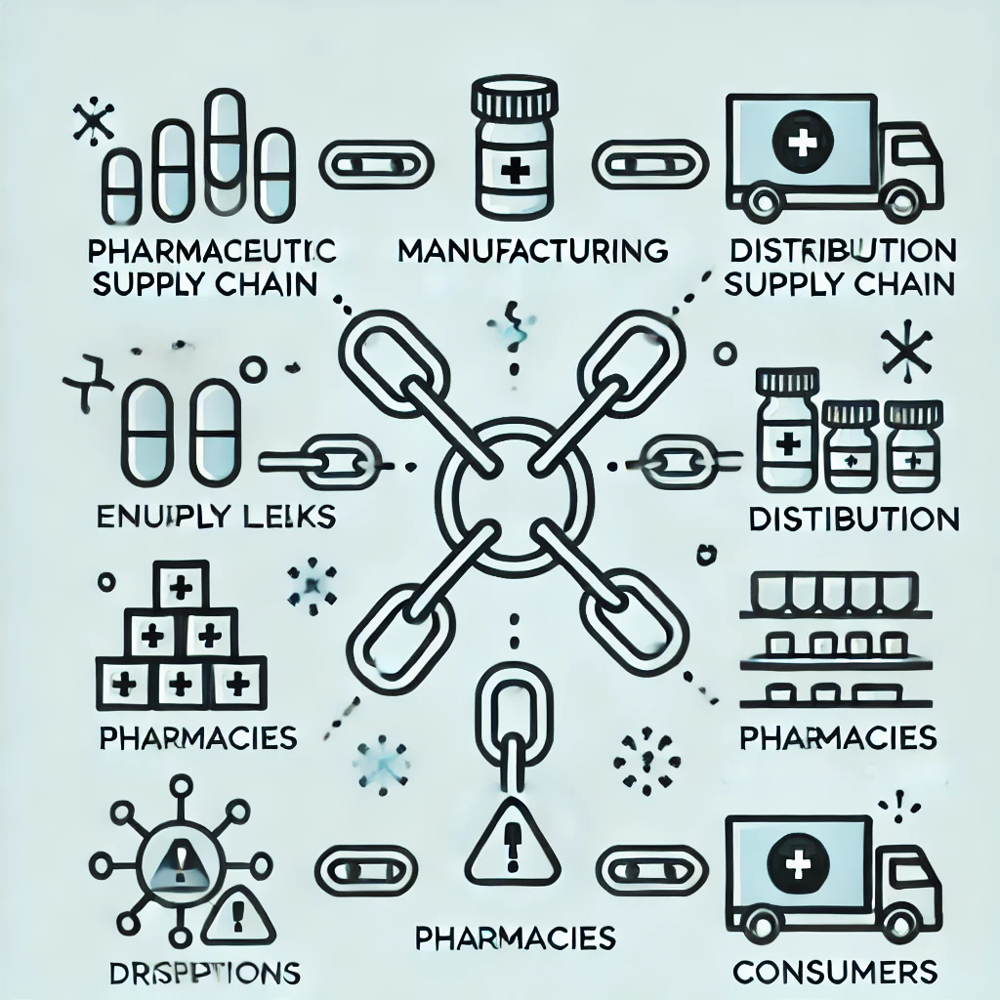
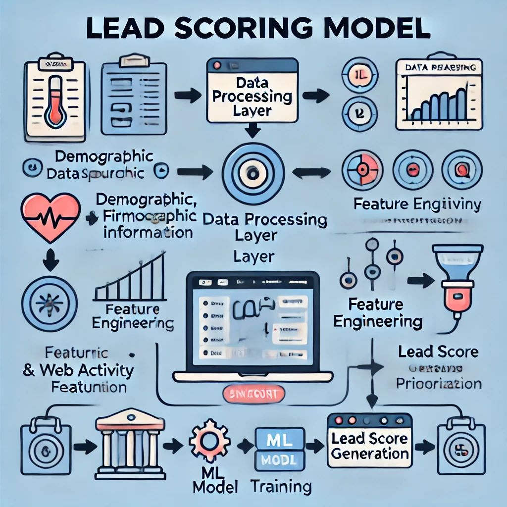
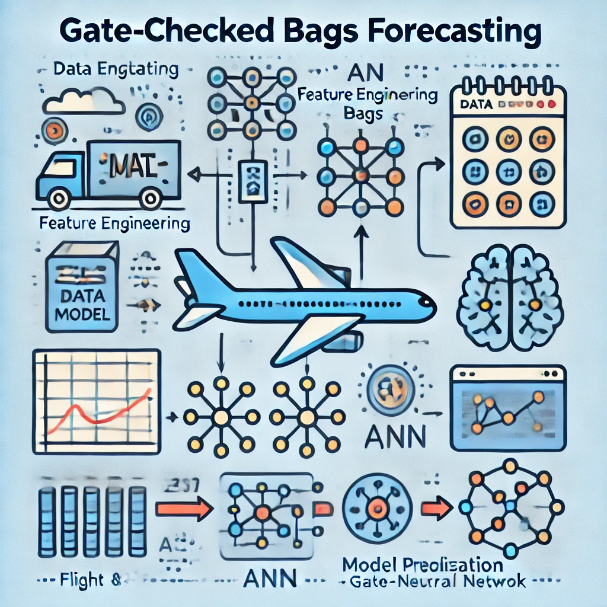
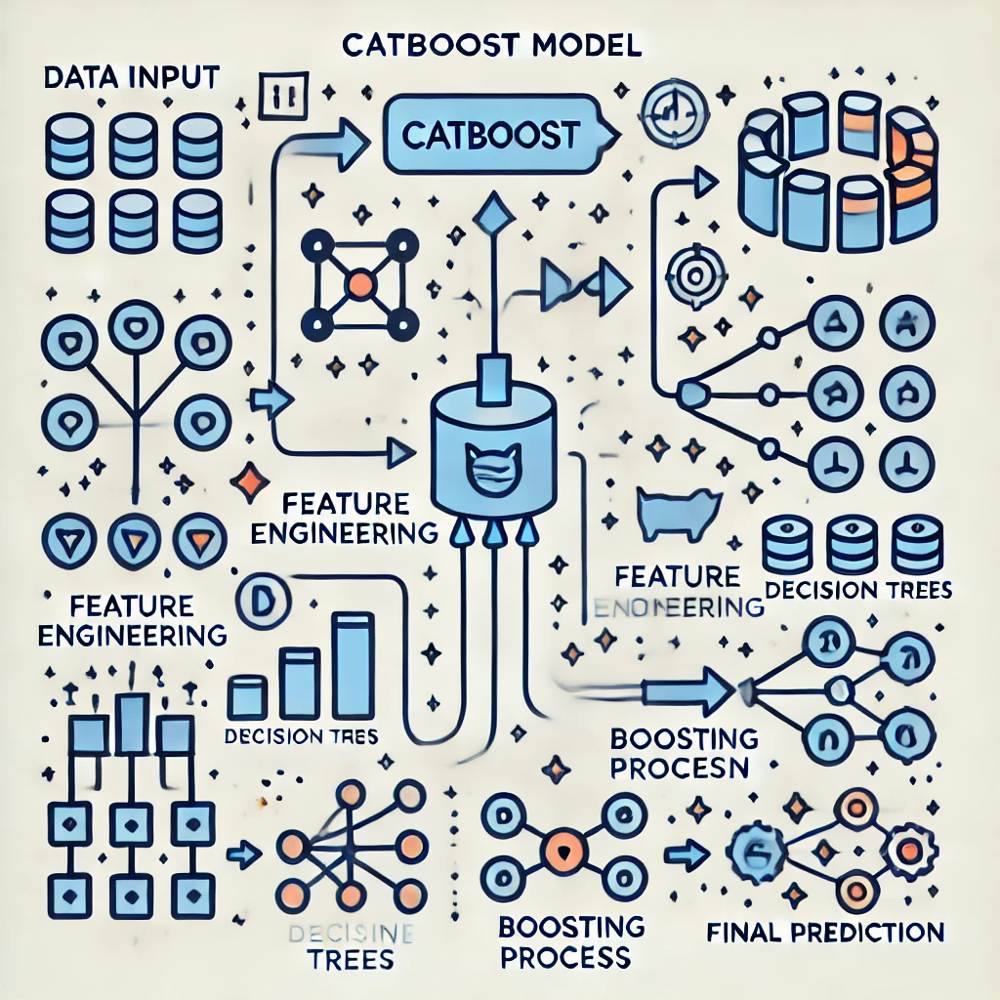

# Hi, I'm Ankit Wahane, Data Science Enthusiast and Consultant
Bengaluru, India

---

## Table of Contents
- [Education 🎓](#education-)
- [Work Experience 💼](#work-experience-)
- [Technical Skills 🛠️](#technical-skills)
- [Awards 🏆](#awards-)
- [Know Me Beyond Work 🌟](#know-me-beyond-work-)
  
---

## Education 🎓

**MTech in Communication and Networks** from Indian Institute of Science, Bengaluru 

**BTech in Electronics and Telecommunication Engineering** from Vishwakarma Institute of Technology, Pune 

---

## Work Experience 💼

### Data Science Associate Consultant @ ZS Associates, Bangalore (_July 2022 - Present_)

**Drug Storage Prediction**
  - Designed and implemented a predictive model using the transformer to forecast drug shortages.
  - Aggregated internal and external data, with LLMs extracting critical features from news sources.
  - Resulted in early detection of national drug shortages with a lead time of 1-2 months.

 

  
  

 

**Pharmacy Orders Forecasting**
  - Constructed a predictive model using XGBoost and ALS to forecast pharmacy orders for retention and cross-selling.
  - Deployed the model end-to-end on AWS infrastructure and utilized OpenAI for model output explainability.
  - Achieved improved sales efficiency and enhanced customer experience.
    

  
  

 

**Bayesian Market Mix Model and Budget Optimizer**
  - Developed a Bayesian Market Mix Model and budget optimizer for a retail chain.
  - Evaluated marketing impact and optimized channel spend.
  - Utilized GPT-3.5 to summarize recommendations and compare scenarios.
  - Estimated 20-25% revenue uptake through our recommendations.

  
  

### Data Science Associate @ ZS Associates, Bangalore (_August 2020 – June 2022_)

**Predictive Lead Scoring Model**
  - Developed and deployed a predictive lead scoring model for a med-tech device manufacturer using AWS SageMaker.
  - Implemented feature engineering and selection processes.
  - Resulted in enhanced lead targeting and optimized resource use, increasing conversion rates.
    

  
  

 

**Gate-Checked Bags Forecasting**
  - Formulated an ML model using CatBoost and ANN to forecast gate-checked bags for an airline.
  - Leveraged flight and passenger data with feature engineering and model optimization to improve prediction accuracy.
  - Achieved a 10-15% reduction in under-prediction of gate-checked bags.

  
  

 

**Insights Extraction Pipeline**
  - Orchestrated an end-to-end pipeline to extract insights from various data sources using NLI models like PubMedBERT on Azure Databricks.
  - Enhanced decision-making and identified critical insights for strategic product narratives (SPN).

### Machine Learning Intern @ Apra Labs, Bangalore (_May 2019 - July 2019_)

**Gaze Capture iOS App**
  - Created a gaze capture iOS app to collect gaze data and trained a model to estimate gaze location.
  - Utilized the model to develop an iOS game and a driver safety application.

### Engineer in Automobile Business Unit @ Tata Elxsi, Bangalore (_August 2016 - May 2017_)

**RTOS Operations**
  - Handled RTOS operations and coordinated different system services and OS calls (IPC) for Audio Amplifiers.
    
---

## Technical Skills 🛠️ 

**Fields of Interest:**  
- 🤖 Machine Learning
- 🧠 Deep Learning
- 🔧 MLOps
- 🗣️ NLP
- 🧩 BERT
- 🔄 Transformer
- 💬 GPT
- 📚 LLMs
- 🔗 LangChain
- 🔍 RAG
- 👨‍💼 Agents
- 🖼️ Computer Vision
- 🖌️ Image Processing
- 🌫️ Diffusion
- 📈 Linear/Non-Linear Optimization
- 📊 Bayesian Statistics

**Developer Tools:**  
- 📝 Git
- ☁️ Google Cloud Platform
- 🔥 Databricks
- 🛠️ AWS
- 🚀 PySpark
- 🔬 PyTorch
- 🧪 Keras
- 🌀 JAX

**Programming Languages:**  
- 🐍 Python
- 🗃️ SQL

**Libraries and Frameworks:**  
- 📚 Scikit-learn
- 🐼 Pandas
- 🔢 Tensorflow
- 🧪 Keras
- 📊 Matplotlib
- 📉 Seaborn
- 📈 Plotly
  
---

## Awards 🏆

**Fostering ZS Culture (Mar 2024):** For fostering ZS culture during the Next Best Order project.

**BHC Project Award (Nov 2023):** For developing an MMM and budget optimization for a retail chain.

**Ingenious Award (Aug 2023):** For leadership in fostering growth in the Beyond Healthcare domain.

**Going Above and Beyond:** For exceptional dedication and performance, awarded during AI Summit 2022.

**Project Champion Award (Aug 2022):** For contributions to the "UA - Airport Predictive Operations" project.

**Impact Award (Oct 2021):** For performance in the "Amgen Medical SPN Analytics - POC" project.

---

## Know Me Beyond Work 🌟

Outside of my professional life, I am passionate about exploring new technologies, travelling, cooking, and engaging in community service. I enjoy reading about advancements in AI and ML, as well as biographies, fiction, and non-fiction books. I am a movie buff who loves watching movies in all regional languages. Below, you may find some of my favourite photos that I have taken.

 

  
  

 
